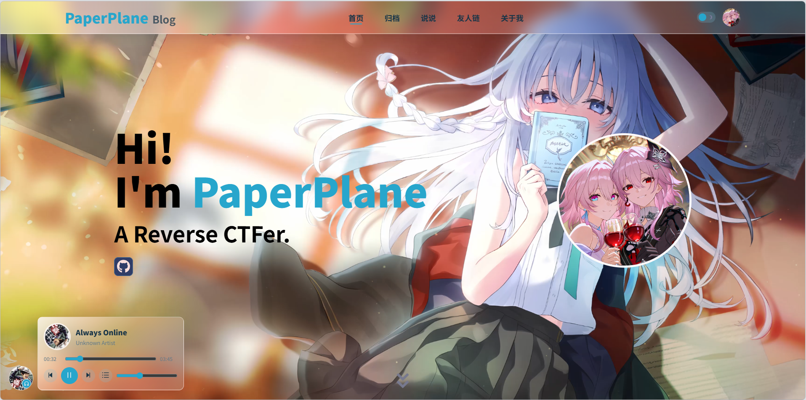
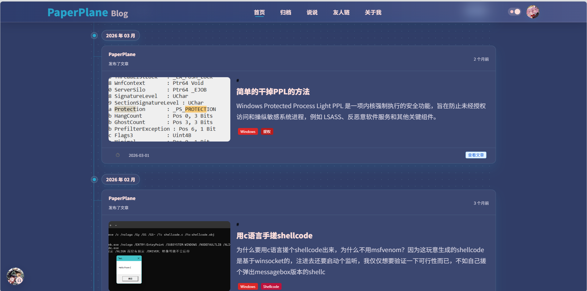
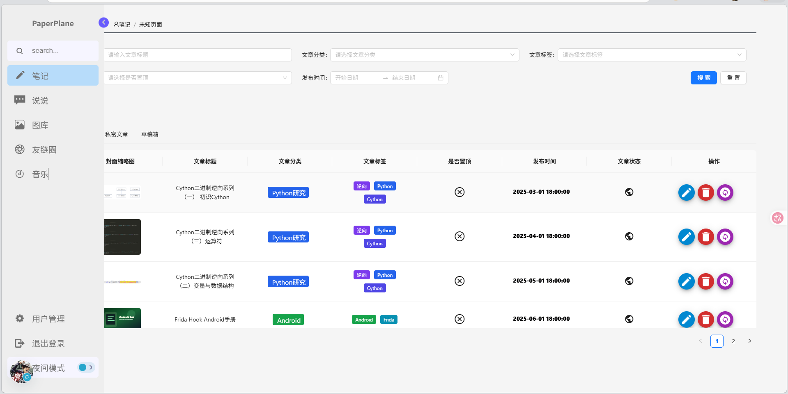

# PaperPlane Blog

PaperPlane Blog is a full-stack personal blog starter built with React, Vite, Spring Boot, MyBatis, and PostgreSQL.Secondary development based on Memory, https://github.com/LinMoQC/Memory-Blog

## Preview

Examples that have been deployed: 
http://blog.paperplane.codes/









## Project Structure

- `PaperPlane-Blog`: frontend application.
- `PaperPlane-Core`: backend API service.
- `docker-compose.deploy.yml`: example full-stack Docker Compose deployment.

## Local Development

1. Copy environment examples if you need local overrides:

```bash
cp PaperPlane-Blog/.env.example PaperPlane-Blog/.env
cp PaperPlane-Core/.env.example PaperPlane-Core/.env
```

2. Start PostgreSQL and the backend, then run the frontend:

```bash
cd PaperPlane-Core
mvn spring-boot:run
```

```bash
cd PaperPlane-Blog
npm install
npm run dev
```

## Default Data

The database initializer creates a neutral starter site, a default category, and a welcome article. Replace the default site information and admin credentials before deploying publicly.
